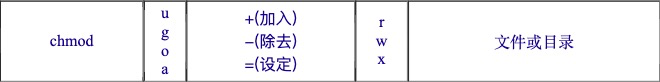
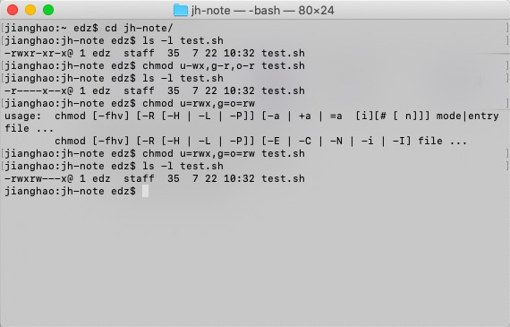
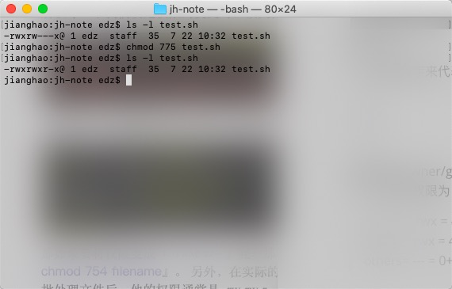
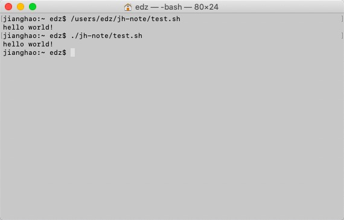

# 7-22

## 一、修改文件属性及权限

* chmod：修改文件权限

  * 符号方式：

    

    

    u=users,g=group,o=others,a=all

    例：chomd u=rwx,g=o=x test.sh

    ​		chomd u+x test.sh

    

    

    

  * 数字方式：

    可以使用数字来代表各个权限，各权限的分数对照表如下：

    > r:4
    > w:2
    > x:1

    每种身份(owner/group/others)各自的三个权限(r/w/x)分数是需要累加的，例如当权限为： [-rwxrwx---] 数字是：

    > owner = rwx = 4+2+1 = 7
    > group = rwx = 4+2+1 = 7
    > others= --- = 0+0+0 = 0

    例：

    

* chgrp：改变所属群组

  例：chgrp users test.sh （users必须存在于目录中）

* chown：改变文件拥有者

  例：chown jh test.sh （将test.sh这个文件的拥有者改为jh这个账号）

  ​		chown jh:users test.sh （将test.sh这个文件的拥有者改为jh，群组改为users）

# 二、执行可执行文件

1. 新建一个可执行文件：touch test.sh

2. 打开：open test.sh

3. 输入打印命令：echo "hello world!"

4. 执行：

   * 绝对路径：/users/edz/jh-note/test.sh

   * 相对路径：./jh-note/test.sh

     

# 三、编辑器

* emacs
* vim
* sublime
* vs-code

# 四、VIM

1. 移动光标   上：k，下：j，左：h，右：l

2. 进入vim编辑器：vimtutor 

   退出：输入:q!<回车>（不保存修改）  wq（保存修改）

3. normal模式下按x删除光标所在位置字符

4. normal模式下按i/I/a/A进入insert模式，添加文本内容

5. 删除类命令：

   | 操作 |              作用              |
   | :--: | :----------------------------: |
   |  dw  | 光标处删除至下一个单词的起始处 |
   |  d$  |      从当前光标删除至行末      |
   |  de  |     光标处删除至该单词末尾     |
   | d2w  |          删除两个单词          |
   |  dd  |            删除整行            |

6. 0：将光标移动至行首

7. u：撤销最后执行的命令

8. p：将dd删除的内容剪切至光标所在行

9. 更改类命令：

   | 操作 |                 作用                  |
   | :--: | :-----------------------------------: |
   |  r   | 输入r和一个字符替换光标所在位置的字符 |
   |  ce  |      改变文本直到一个单词的末尾       |
   | c2w  |           更改2个单词的文本           |

10. 定位并显示文件状态信息：control+G

11. 光标移至文首：gg       光标移至文尾：G     光标移至111行：111G

12. 查找字符串：/字符串<回车>

    * 往下搜寻：n     网上搜寻：N
    * 回到之前位置：control+O

13. 查找配对的括号：%

14. 替换字符串：

    * 输入            :s/要被替换的字符串/替换后的字符串 <回车>（只替换该行第一个）
    * 输入            :s/~/~/g（替换该行全部字符串）
    * 输入            :起始行行号,结尾行行号s/old/new/g（替换若干行中的old字符串）
    * 输入            :%s/old/new/g（替换整个文件的old字符串）

    