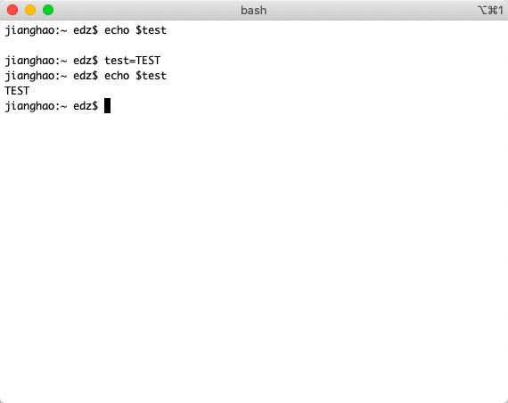

# 7-24

## 一、shell

* 变量的取用：echo   例： echo $PATH或echo ${PATH}

  * 配置或修改变量内容：例：

    

    注：1. 变量与变量内容以一个等号连接

    2. 等号两边不能直接接空格符 ❌myname = Vbird
    3. 变量名称只能是英文字母或数字，但开头字符不能是数字
    4. * var ="lang is $LANG" 则输入echo $var  -------lang is en_US
       * var='lang is $LANG'则输入echo $var ---------lang is $LANG
    5. 取消变量配置：unset 变量名

