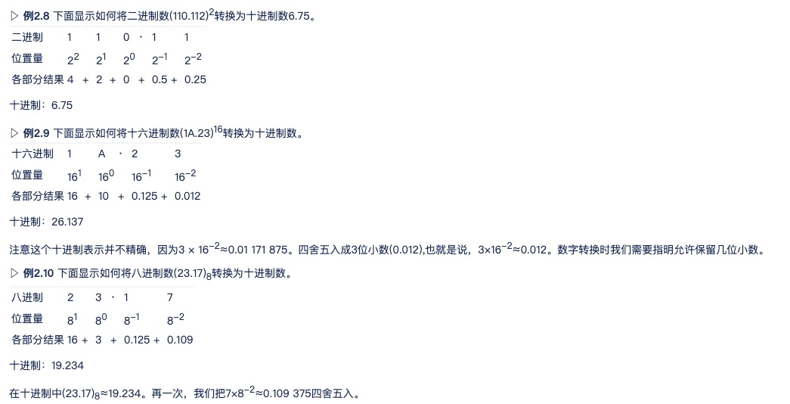
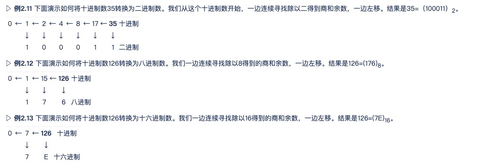
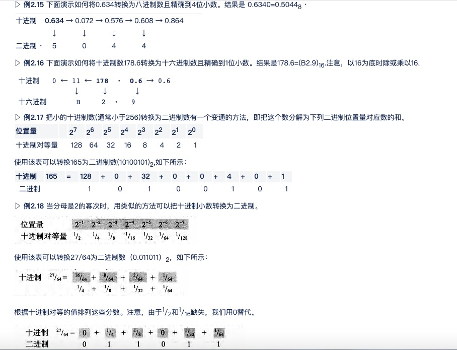

# 7-27

# 一、数字系统

### ①特点：

十进制：逢十进一（常用）；decimal

二进制：逢二进一；binary

八进制：逢八进一；octal

十六进制：逢十六进一；sexadecimal，A,B,C,D,E,F(大写或小写)分别等于10,11,12,13,14和15。

### ②转换：

1. 任意进制到十进制的转换

   

2. 十进制到其他进制的转换

整数部分：

小数部分：

3. 二进制-十六进制的转换

二进制中的4位恰好是十六进制中的1位

4. 二进制-八进制的转换

二进制中的3位恰好是八进制中的1位

5. 八进制-十六进制的转换

八进制------二进制-------十六进制

## 二、数字存储

1. 位

位(bit，binary digit的缩写)是存储在计算机中的最小单位它是0或1。位代表设备的某一状态，这些设备只能处于两种状态之一。例如，开关要么合上要么断开。用1表示合上状态，0表示断开状态。电子开关就表示一个位。换句话说，一个开关能存储一个位的信息。今天，计算机使用各种各样的双态设备来存储数据。

2. 不同数据类型的存储

如果使用文本编辑器(文字处理器)，键盘上的字符A可以以8位模式01000001存储。如果使用数学程序，同样的8位模式可以表示数字65。类似地，同样的位模式可表示部分图像、部分歌曲、影片中的部分场景。计算机内存存储所有这些而无需辨别它们表示的是何种数据类型。

3. ASCII码

man ascii 查看各符号的ascii码

4. 补码

正数的补码与原码相同

负数的补码对该数的原码除第一位符号位外都各位求反，再在最后一位加1

5. 无符号数

正整数

6. 有符号数

最高位为符号位，0表示+，1表示-

8位计算机的取值范围：-127~+127

7. 为什么用补码？

计算机不会减法

### 补码相关运算

* 十进制数求补码

  正数化为原码即可；负数先求相反数的二进制原码，再对其符号位之外的各位取反+1

* 求一个数相反数的补码

  * 给正数，求相反数的补码：正数的原，反，补码相同。他的相反数的原码是修改符号位（最高位），反码是除了符号位，其余各位按位取反，补码是反码+1
  * 给负数：先减一，在按位取反