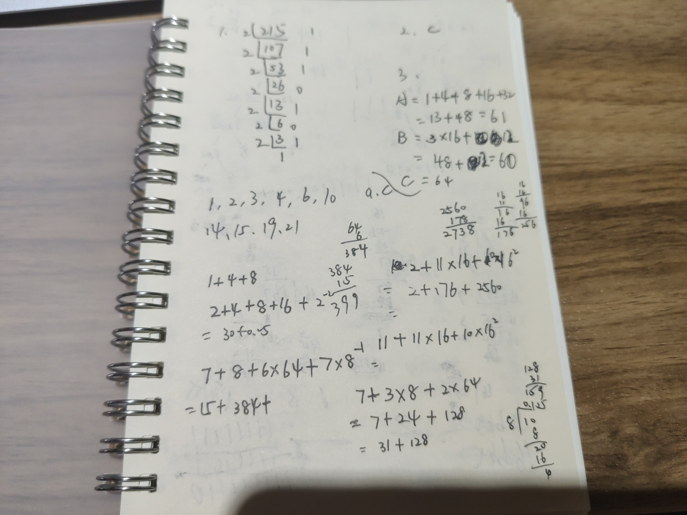
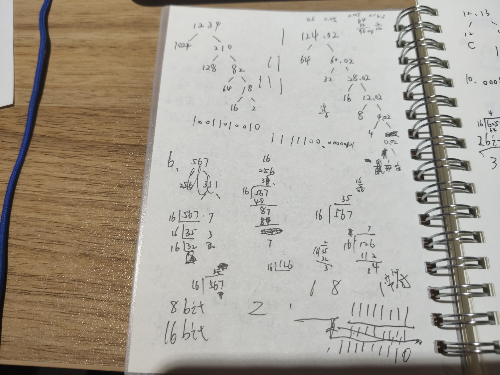
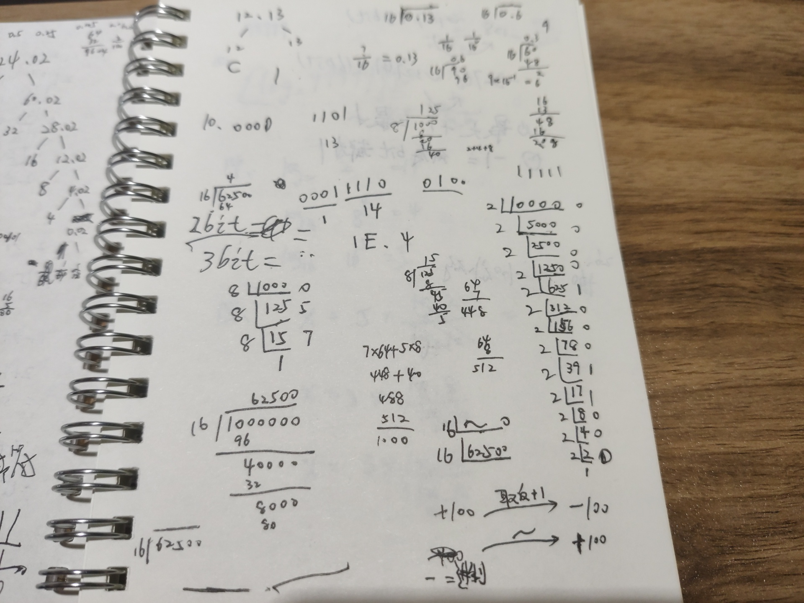
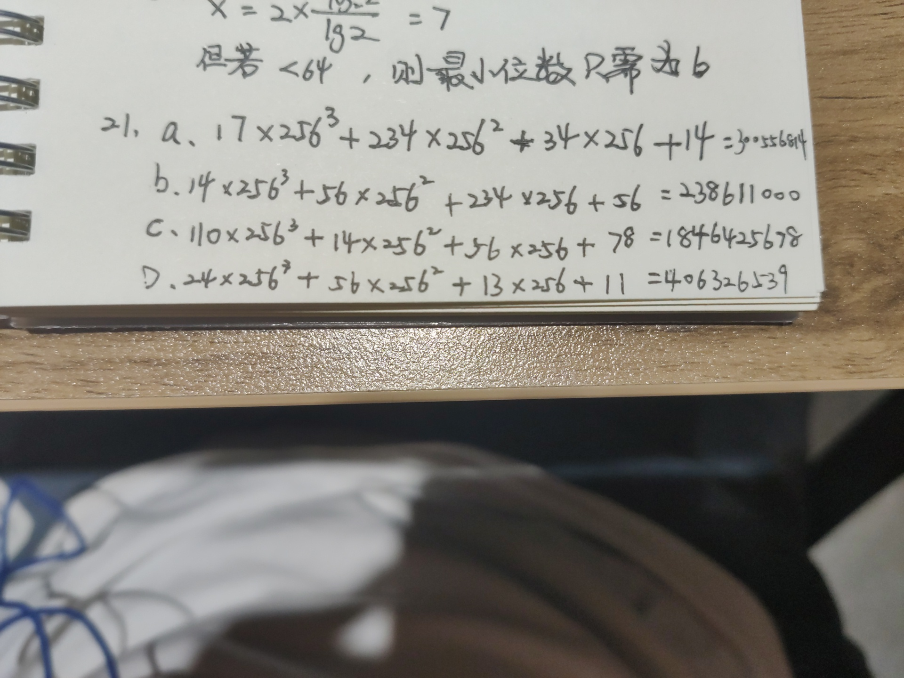
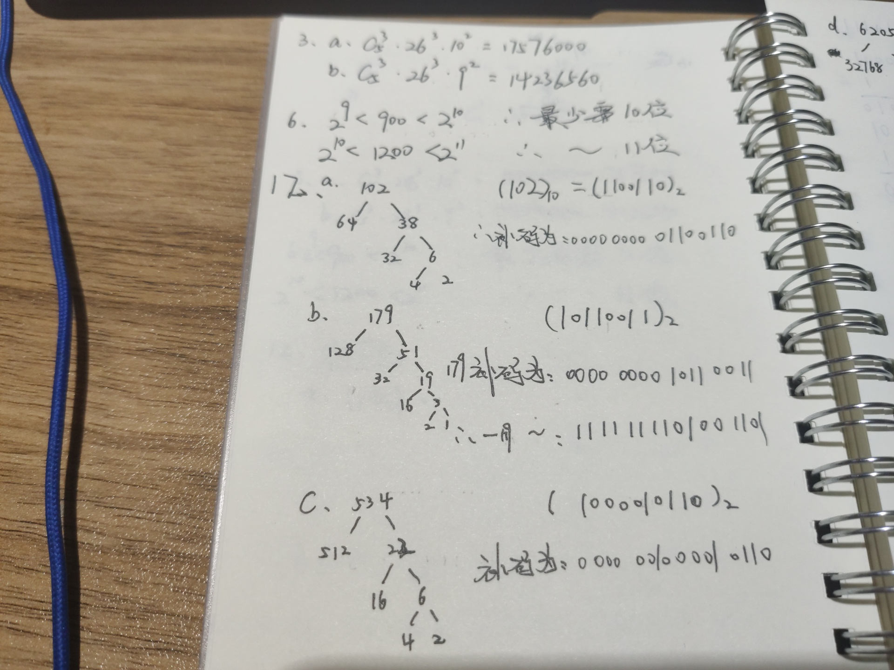
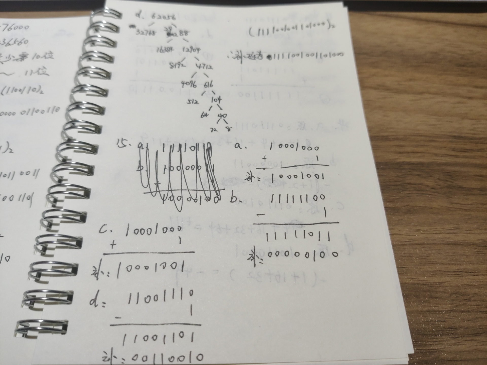
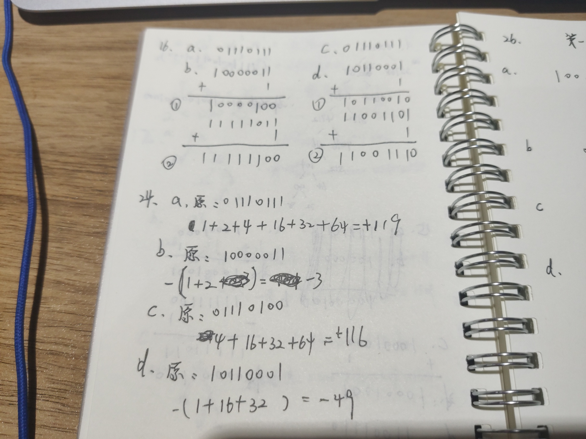
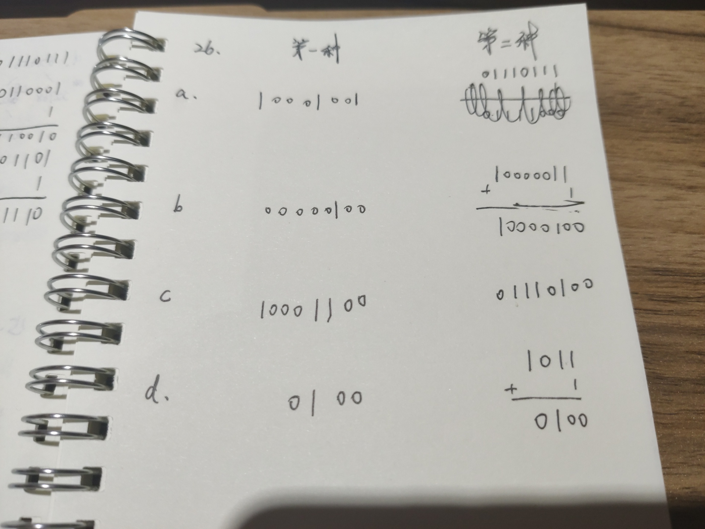

第二章：

1.    a.13       c.30.25
2.    a.2738   c.2747
3.    a.159     c.399.125
4.    a.10011010010    c.1111100.00000101

6. a.237     c.C.2

10. a.D         c.1E.4

(草稿如下)

以下是正文：答题过程

第三章：

1.2的5次方=32

2.100种        81种

