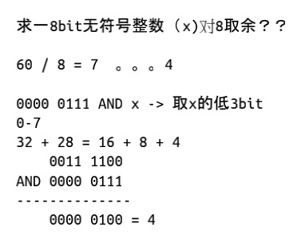
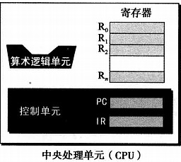
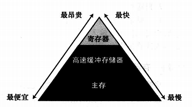
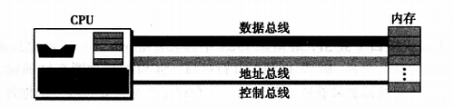

# 7-28

## 一、数字运算

1. 逻辑运算

   * 与   两者都为真才为真
   * 或   有一为真则为真
   * 非   取反
   * 异或  两者不同才为真

2. bit运算

   * 

3. 左移右移

   * 左移：1位：乘以2

     ​            2位：乘以4~~~~

   * 右移：1位：除以2~~~~

4. 加减乘除取余

## 二、计算机组成

1. 计算机组成：中央处理单元（CPU）、主存储器、输入输出子系统

2. 中央处理单元：

   

   * 算术逻辑单元（ALU）：对数据进行逻辑、移位、算术运算
   * 寄存器：用来存放临时数据的高速独立的存储单元；分为数据寄存器、指令寄存器、程序寄存器（PC）
   * 控制单元：控制各个子系统的操作。

3. 主存储器：存储单元的集合，每一个存储单元都有唯一的标识，称为地址。数据以称为字的位组的形式在内存中传入和传出。宇可以是8位、16位、32位，甚至有时是64位(还在增长)，如果字是8位，一般称为1字节。

   * 地址空间：在存储器中存取每个字都需要有相应的标识符。尽管程序员使用命名的方式来区分字(或一组字的集合)，但在硬件层次上，每个字都是通过地址来标识的。所有在存储器中标识的独立的地址单元的总数称为地址空间。例如，一个64 KB、字长为1字节的内存的地址空间的范围为0～65 535。

     **作为位撲式的地址**

     由于计算机都是以**位模式**存储数并进行运算，因此地址本身也是用位模式表示的。如果一个内存是64K(216)，宇长为1字节，那么就需要16位的位模式来确定地址。回顾第3章我们曾经提到地址用无符号整数表示(不用负的地址)。换言之，起始地址通常是0000000000000000(地址0)，最后一个地址通常是1111111111111111(地址65 535)。通常，如果一个计算机有N个字的存储空间，那就需要有log2N位的无符号整数来确定一个存储单元。

   * 存储器的层次结构：

   * 高速缓冲存储器：

     * 存取速度：CPU及其内部的寄存器>高速缓冲存储器>主存

     * CPU存取主存中一个字的步骤：CPU检查高速缓存存储器，若存在，CPU将它复制；不存在则从主存中复制一份从需要读取的字开始的数据块，并将它覆盖高速缓存存储器中的内容。

4. CPU和存储器的连接：

* 数据总线：**数据总线**是由多根线组成，每一根线上每次传送1位的数据。线的数量取决于计算机的字的大小，**线的数量决定了同一时间能传送的数据**。例如，计算机的字是32位(4字节)，那么需要有32根线的数据总线，以便同一时刻能够同时传送32位的字。
* 地址总线：**地址总线**允许访问存储器中的某个字，地址总线的线数取决于存储空间的大小。如果存储器容量为2^n个字，那么地址总线一次需要传送n位的地址数据。因此它需要n根线。
* 控制总线：**控制总线**负责在中央处理器和内存之间传送信息。例如，必须有一个代码从CPU发往内存，用于指定进行的是读操作还是写操作。控制总线的线数取决于计算机所需要的控制命令的总数。如果计算机有2m条控制命令，那么控制总线就需要有m根，因为m位可以定义2m个不同的操作。