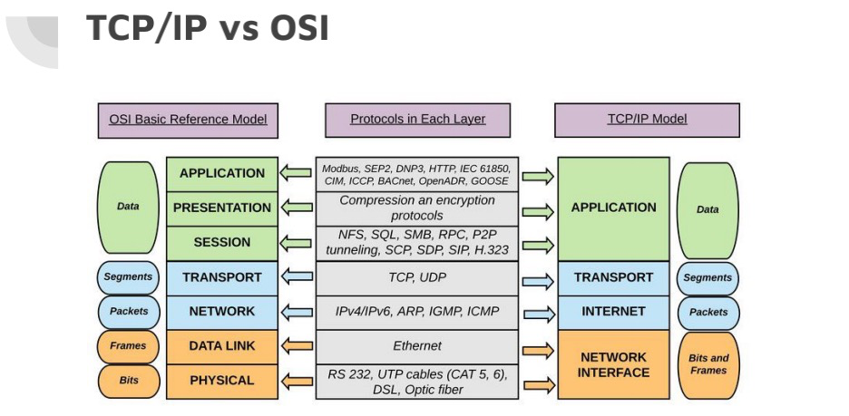

# 7-29

# 一、计算机网络

1. 网络

   **网络**是一系列可用于通信的设备相互连接构成的，在一个网络中，这些设备都通过有线或无线传输媒介(比如电缆或无线信号)互相连接。

   按覆盖范围可分为以下几类：

   * 局域网（LAN）：通常是与单个办公室、建筑或校园内的几个主机相连的私有网络。
   * 广域网（WAN）：局域网将主机互连，广域网则将交换机、路由器或调制解调器之类的连接设备互连。通常，局域网为机构私有，广域网则由通信公司创建并运营，并且租给使用它的机构。
   * 因特网：由成千上万个互连的网络组成

   ifconfig命令中的en0可查看以下地址：

   * mac地址：机器网卡的物理地址，这个地址相当于网卡的身份证，全球唯一，出厂的时候就设定好了，不可更改
   * ip地址：私网ip，ipv4，机器在局域网内的ip，192.168开头

2. TCP/IP分层协议：

   

   **为什么要分层？**

   * 改动自由：如果互联⽹只由⼀个协议统筹，某个地⽅需要改变设计时，就必须把所有部分整体替换掉。 ⽽分层之后只需把变动的层之间的接⼝部分规划好之后， 每个层次内部的设计就能够⾃由改动了。 
   * 设计简单：层次化之后，设计也变得相对简单了。处于应⽤层上的应⽤可以只考虑分派给⾃⼰的任务，⽽不需要弄清对⽅的传输路线是怎样的、是否能确保传输送达等问题。

3. 物理层：物理层的角色是将从数据链路层接收的位转换成用于传输的电磁信号。当位被转换成信号后，信号将被传送至传输媒介。传输媒介主要包括：双绞线（网线）、光纤

4. 数据链路层：这层是网络中连接起来后可以构成因特网的区域。这些网络，有线或者无线，都接收服务并将服务提供给网络层。

   有线LAN:以太网     无线LAN:WIFI

   交换机：在局域网中连接各个计算机，组成网络

5. 网络层：负责源到目的地（计算机到计算机或主机到主机）的消息发送。在源主机(Alice)处，网络层从传输层接收了一个数据包，它将数据包封装在一个数据报中，并且发送至数据链路层。在目标主机(Bob)处，这个数据报就被解除封装，取出数据包并发送至相应的传输层。

   * 私有ip：不能直接连上 Internet 的 IP ，主要用于局域网络内的主机联机规划

   * 公有ip：经由 INTERNIC 所统一规划的 IP，有这种 IP 才可以连上 Internet

     **我们能够上网靠的是isp组织分给我们的Ip地址，但是这个ip地址一般不是给个人的，一般都是给一个单位，一个区域的，也就是说我们实际上能接触到的一般都是[私有地址]，即我们用ifconfig查到的都是[私有地址]，也就相当于局域网内的ip地址，当我们真正联网时，会先把数据发送到路由，然后再由路由进行处理实现真正的联网操作，路由的地址才是真正联网的ip地址，也就是pubilc ip，而我们在自己电脑上查到的都是私有ip**

   * 路由器：路由器接收到一个IP数据包，会根据包中得目标IP地址，来进行选择路径并转发。

   * 网关：网关在网络层以上实现网络互连，是复杂的网络互连设备，仅用于两个高层协议不同的网络互连。网关既可以用于广域网互连，也可以用于局域网互连。

6. 传输层：位于应用层和网络层之间，它从网络层接收服务并且为应用层提供服务。传输层作为一个客户程序和服务器程序之间的联络，是一个过程间连接。传输层是TCP/IP协议族的核心部分，它是一个在网络中从一点向另一点进行数据传输的端与端之间逻辑媒介。

7. 应用层：应用层向用户提供服务。

8. URL:例 https://Zhuanlan.zhihu.com/p/23423423 

   其中：Https:协议         http    file socks

   Zhuanlan.zhihu.com  域名  DNS:域名---->ip地址

   443：默认端口号

   /p/23423423  PATH路径：定位资源

## 二、操作系统

1. 计算机系统

   * 硬件
   * 软件：操作系统、应用软件

2. 自举过程：加电自检：当我们按下计算机电源开关时，头几秒钟机器似乎什么反应也没有，其实，这时的计算机正在进行加电自检，以断定它的所有元件都在正确地工作。如果某个元件有故障，显示器上就会出现报警提示信息（如果显示器也不能正常工作，则以一串嘟嘟声来报警）。由于大多数计算机工作非常可靠，加电自检报警非常罕见。  磁盘引导：查找装有操作系统的磁盘驱动器。从磁盘加载操作系统的原因有二：一是操作系统升级简单容易，二是使用户拥有选择操作系统的自由。当以上功能完成时，自举操作就启动一个读写操作系统文件和将它们复制到随机存储器中的过程，此时的机器才是真正意义上的计算机。

3. 演化

   * 批处理系统：DOS 每次做一个任务 
   * 分时 一个CPU的一个核，提高效率，在IO等待的时候执行其他任务 
   * 个人 pad，手机，良好的UI
   * 并行 多核多线程，不同的核或线程做不同的任务 
   * 分布式 多点共同计算完成一个任务 
   * 实时 对响应速度要求高，并不是CPU越厉害就能响应越快

4. 队列：状态图显示了一个作业或进程从一个状态进入另一个状态。事实上，会有很多的作业和进程相互竞争计算机资源。例如，当一些作业进入内存时，其他的就必须等待直到有了可用空间。或者当一个进程正在使用CPU时，其他进程就必须等待直到CPU空闲为止。为处理多个进程和作业，进程管理器使用**队列**(等待列表)。

5. 死锁：**当操作系统没有对进程的资源进行限制时将会发生死锁。**

   死锁不是经常发生，死锁发生需要4个必要条件

   - **互斥**。一个资源只能被一个进程占有；
   - **资源占有**。一个进程占有一个资源，即使在获取其他资源之前无法使用它；
   - **抢先**。操作系统不能临时对资源重新分配；
   - **循环等待**。所有的进程和资源包含在一个循环里，如图7-16所示。

   所有4个条件都是死锁发生所必需的。但是它们只是必要条件(不是充分条件)，也就是说对于死锁来说它们必须同时出现，但它们并不一定能引起死锁。换句话说，如果它们其中之一没有出现，死锁不会发生。这样就给我们提供了一种方法来防止或避免死锁不让它们中的某一条件发生。

6. 饿死：是一种与死锁相反的情况。它发生在当操作系统对进程分配资源有太多限制的时候。例如，假使一个操作系统中规定一个进程只有在所需的所有资源都为其占有时才能执行。