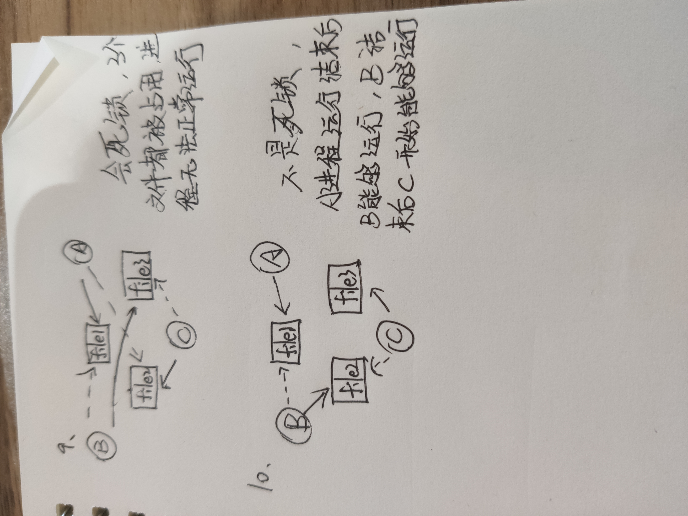

# 第六章

## 复习题

8.**在周末，Alice经常要通过她的笔记本电脑访问保存在办公室台式机上的文件。上周她在办公室台式机上安装了一个FTP服务器程序的副本，在家里的笔记本电脑上安装了FTP客户机程序的副本。她很失望周末无法访问到她的文件。这可能出现什么差错了?**

不在同一个局域网，无法连接私网ip

9.**大多数安装在个人计算机上的操作系统带有几个客户端进程，但通常没有服务器进程，请解释原因。**

服务器进程通常在服务器上

## 练习题

3.**假设连接到因特网的主机在2010年是5亿台。这个数字以每年20%的速度增长，到2020年主机数量是多少?**

5*(1.2)^10=31（亿台）

9.**比较16位端口地址(0〜65535)和32位IP地址(0〜4294967295)的范围，为什么我们需要IP地址有如此大的范围，但端口号却相对范围小呢?**

电脑同时刻开启的进程数量有限

**解释浏览器输入 www.baidu.com并回车到底发生了些什么？？**

* 浏览器通过DNS查询www.baidu.com服务器的ip地址
* 查到后通过URL向百度服务器发送http/https请求
* 百度服务器响应并回复html代码
* 浏览器将html代码渲染成页面

# 第七章

## 复习题

9.**为什么操作系统需要队列?**

队列会防止各进程因竞争资源而造成死锁

10.**死锁和饿死有何区别?**

* 从进程状态考虑，死锁进程都处于等待状态，忙等待(处于运行或就绪状态)的进程并非处于等待状态，但却可能被饿死；

* 死锁进程等待永远不会被释放的资源，饿死进程等待会被释放但却不会分配给自己的资源，表现为等待时限没有上界(排队等待或忙式等待)；

* 死锁一定发生了循环等待，而饿死则不然。这也表明通过资源分配图可以检测死锁存在与否，但却不能检测是否有进程饿死；

* 死锁一定涉及多个进程，而被饿死的进程可能只有一个。

* 在饿死的情形下，系统中有至少一个进程能正常运行，只有饿死的那个进程得不到执行机会。而死锁则可能会最终使整个系统陷入死锁并崩溃。

## 练习题

9.**三个进程(A、B和C)同时运行，进程A占用File1但需要File2。进程B占用File3但需要File1。进程C占用File2但需要File3。为这几个进程画一个框图。这种情况是不是死锁?**

10.**三个进程(A、B和C)同时运行，进程A占有File1，进程B占有File2但需要File1,进程C占有File3但需要File2。为这几个进程画一个框图。这种情况是不是死锁?如果不是，说明进程怎样最后完成它们的任务。**

